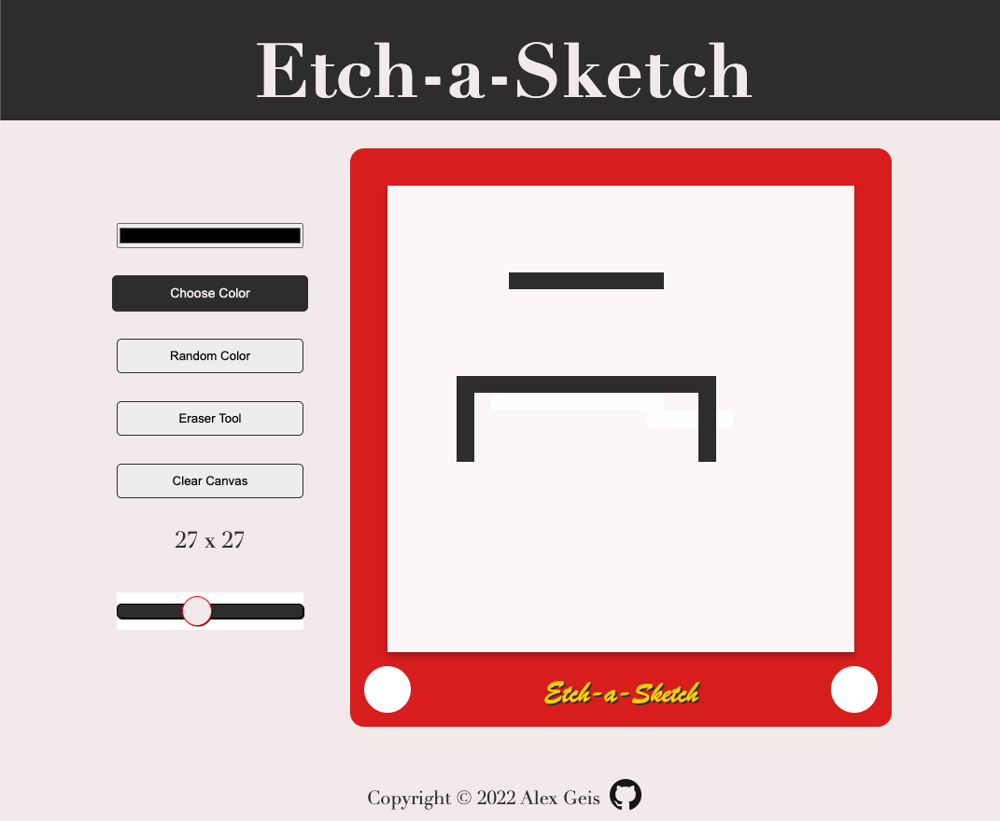

# Etch-a-Sketch

Drawing application using vanilla JS,custom CSS/HTML, and local storage. Color and size can be adjusted, as well as a rainbow mode for random colors.

[Deployed Demo](https://alexgeis.github.io/Etch-a-Sketch/) &larr;

## Future Development

- Different color modes: neon, rainbow, etc.
  Suggestion: the generative CSS can use a calc() function, as outlined in [this excellent article](https://moderncss.dev/practical-uses-of-css-math-functions-calc-clamp-min-max/) (credit to [@5t3ph](https://github.com/5t3ph))

## Screenshot

